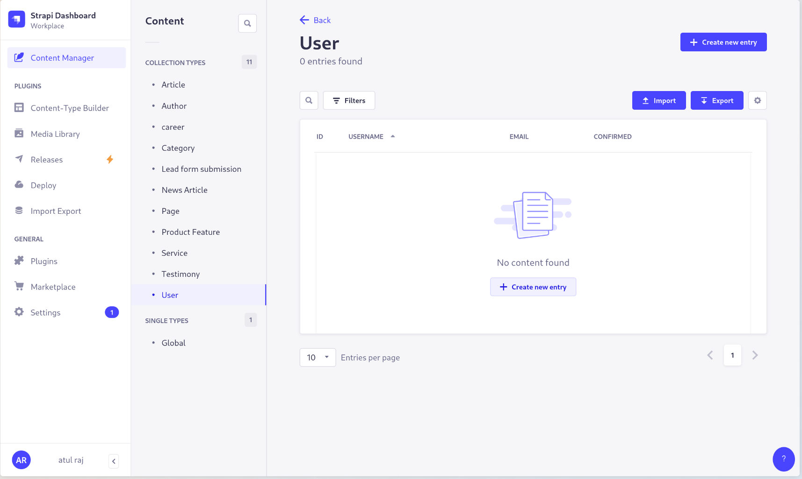
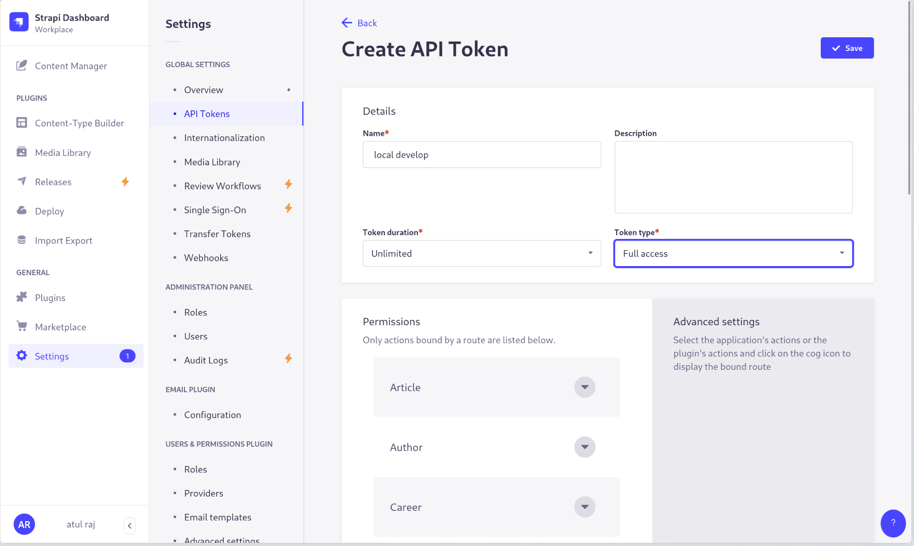
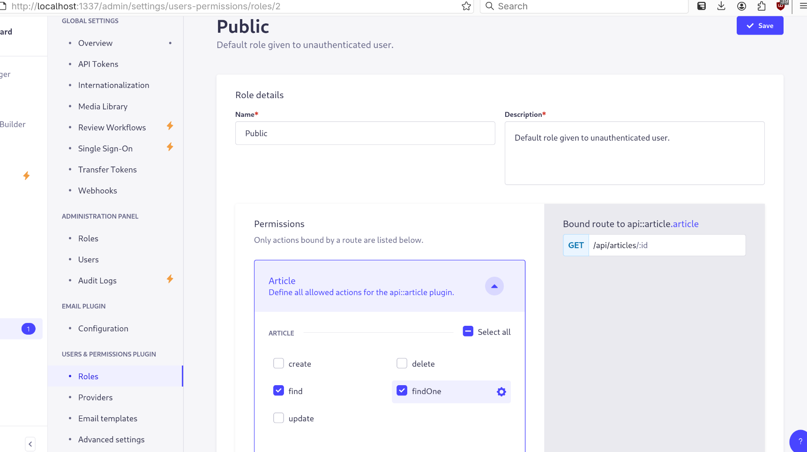

## Instructions:

### Clone backend

```bash
git clone git@github.com:atulraj85/the_three_across_backend.git

```

#### Add .env file

Data in .env file

```plaintext
HOST=0.0.0.0
PORT=1337
APP_KEYS="8X9yZ2q1pR7sT6uV5wW4xY3zA1bC0dE2fG,7H6jK5lL4mN3oP2iQ1rS9tU8vW0xY5z"
API_TOKEN_SALT=JkLmNoPqRsTuVwXyZ0123456789+ab/cdEfGhIjKlMnOpQ
ADMIN_JWT_SECRET=9aBc8DeF7gHi6JkL5mNo4PqR3sTu2VwX1yZ0+1/2ab3cd4ef5gh6ij7kl8
TRANSFER_TOKEN_SALT=mnOpQrStUvWxYz0123456789AbCdEfGhIjKlMnOpQrStUvWxYz
JWT_SECRET=1a2B3c4D5e6F7g8H9i0JkLmNoPqRsTuVwXyZ0123456789+ab/cd=
```

#### Install packages and running the development server

```bash
yarn && yarn develop
```

Running the develop server will start

```bash
strapi develop
```

```bash
atuld@fedora:~/Desktop/GennextIT/the3across/the_three_across_backend$ yarn develop
yarn run v1.22.22
$ strapi develop
⠋ Building build context
⠙ Building build context[INFO] Including the following ENV variables as part of the JS bundle:
    - ADMIN_PATH
    - STRAPI_ADMIN_BACKEND_URL
    - STRAPI_TELEMETRY_DISABLED
✔ Building build context (168ms)
⠙ Creating adminBrowserslist: caniuse-lite is outdated. Please run:
  npx update-browserslist-db@latest
  Why you should do it regularly: https://github.com/browserslist/update-db#readme
✔ Creating admin (27979ms)
⠋ Loading Strapi
   ╭──────────────────────────────────────────────────────────────────────────────╮
   │                                                                              │
   │             A new version of Strapi is available 4.25.1 → 5.19.0             │
   │   Check out the new releases at: https://github.com/strapi/strapi/releases   │
   │                                                                              │
   ╰──────────────────────────────────────────────────────────────────────────────╯

✔ Loading Strapi (27896ms)
✔ Generating types (1047ms)

 Project information

┌────────────────────┬──────────────────────────────────────────────────┐
│ Time               │ Thu Jul 24 2025 12:16:06 GMT+0530 (India Standa… │
│ Launched in        │ 28969 ms                                         │
│ Environment        │ development                                      │
│ Process PID        │ 37036                                            │
│ Version            │ 4.25.1 (node v18.20.8)                           │
│ Edition            │ Community                                        │
│ Database           │ sqlite                                           │
└────────────────────┴──────────────────────────────────────────────────┘

 Actions available

One more thing...
Create your first administrator 💻 by going to the administration panel at:

┌─────────────────────────────┐
│ http://localhost:1337/admin │
└─────────────────────────────┘

```

### Create Admin user

Give your basic/dummy details

Remember the credentials though

Ka%k&#H^uY~'NPoHl7x#nKLiJrY);ZRuqdKGw

---

### The Dashboard



Clone the repo and keep all the things same will show the existing Content Types.

---

### Create API token and save it



Make sure to copy the token :

10273dcc4a63431ced0baacfbac33a7c05edaa5c4b74a4e6ff29bef7c52e3a5237f1bd585ddf6e3b916c9666173b76f67094660cc6889bfa57d526ed5df102c6dc95631669111d8273321cf7a8e3ebe4c00d0a2ae550cf9e0b58f5e054db19acd64afa5266a313f988de6bed0aeda1b33a026178b3e266401ba850aa95cc2b79

This my token, yours will be different.

---


## Users and Permission





You have to allow public access to content types. 


---


Perfect now you can start with the Frontend: 


---


Clone frontend
Add .env.local
Update the API token with newly created one.
yarn && yarn dev
