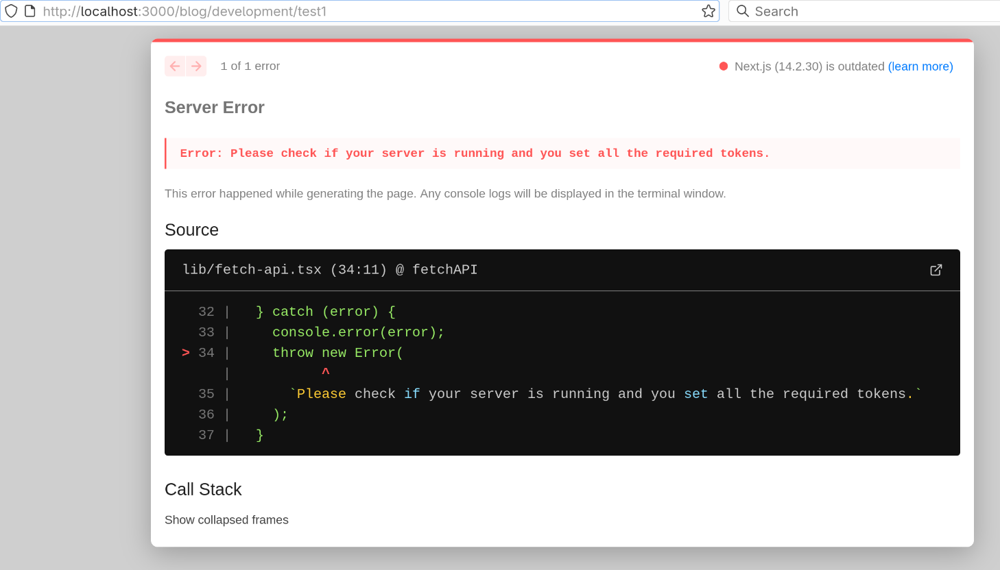

i had created an article and now fetching it in frontend. 

```bash
Server Error

Error: Please check if your server is running and you set all the required tokens.
This error happened while generating the page. Any console logs will be displayed in the terminal window.
Source

lib/fetch-api.tsx (34:11) @ fetchAPI

  32 |   } catch (error) {
  33 |     console.error(error);
> 34 |     throw new Error(
     |           ^
  35 |       `Please check if your server is running and you set all the required tokens.`
  36 |     );
  37 |   }

Call Stack
```


---


i have added the token in .env file

then why this is happening.


---


### Full Error:

```bash
TypeError: fetch failed
    at node:internal/deps/undici/undici:12637:11
    at process.processTicksAndRejections (node:internal/process/task_queues:95:5)
    at async fetchAPI (webpack-internal:///(rsc)/./lib/fetch-api.tsx:28:26)
    at async Object.generateStaticParams (webpack-internal:///(rsc)/./app/blog/[category]/[slug]/layout.tsx:93:29)
    at async buildParams (/home/atuld/Desktop/GennextIT/the3across/the_three_across_frontend/node_modules/next/dist/build/utils.js:1026:40)
    at async /home/atuld/Desktop/GennextIT/the3across/the_three_across_frontend/node_modules/next/dist/build/utils.js:1043:33
    at async Object.loadStaticPaths (/home/atuld/Desktop/GennextIT/the3across/the_three_across_frontend/node_modules/next/dist/server/dev/static-paths-worker.js:48:16) {
  cause: Error: connect ECONNREFUSED ::1:1337
      at TCPConnectWrap.afterConnect [as oncomplete] (node:net:1555:16)
      at TCPConnectWrap.callbackTrampoline (node:internal/async_hooks:128:17) {
    errno: -111,
    code: 'ECONNREFUSED',
    syscall: 'connect',
    address: '::1',
    port: 1337
  }
}
 ⨯ lib/fetch-api.tsx (34:11) @ fetchAPI
 ⨯ Error: Please check if your server is running and you set all the required tokens.
    at fetchAPI (webpack-internal:///(rsc)/./lib/fetch-api.tsx:33:15)
    at process.processTicksAndRejections (node:internal/process/task_queues:95:5)
    at async Object.generateStaticParams (webpack-internal:///(rsc)/./app/blog/[category]/[slug]/layout.tsx:93:29)
    at async buildParams (/home/atuld/Desktop/GennextIT/the3across/the_three_across_frontend/node_modules/next/dist/build/utils.js:1026:40)
    at async /home/atuld/Desktop/GennextIT/the3across/the_three_across_frontend/node_modules/next/dist/build/utils.js:1043:33
    at async Object.loadStaticPaths (/home/atuld/Desktop/GennextIT/the3across/the_three_across_frontend/node_modules/next/dist/server/dev/static-paths-worker.js:48:16) {
  type: 'Error',
  page: '/blog/development/test1'
}
  32 |   } catch (error) {
  33 |     console.error(error);
> 34 |     throw new Error(
     |           ^
  35 |       `Please check if your server is running and you set all the required tokens.`
  36 |     );
  37 |   }
 ⨯ lib/fetch-api.tsx (34:11) @ fetchAPI
 ⨯ Error: Please check if your server is running and you set all the required tokens.
    at fetchAPI (webpack-internal:///(rsc)/./lib/fetch-api.tsx:33:15)
    at process.processTicksAndRejections (node:internal/process/task_queues:95:5)
    at async Object.generateStaticParams (webpack-internal:///(rsc)/./app/blog/[category]/[slug]/layout.tsx:93:29)
    at async buildParams (/home/atuld/Desktop/GennextIT/the3across/the_three_across_frontend/node_modules/next/dist/build/utils.js:1026:40)
    at async /home/atuld/Desktop/GennextIT/the3across/the_three_across_frontend/node_modules/next/dist/build/utils.js:1043:33
    at async Object.loadStaticPaths (/home/atuld/Desktop/GennextIT/the3across/the_three_across_frontend/node_modules/next/dist/server/dev/static-paths-worker.js:48:16) {
  type: 'Error',
  page: '/blog/development/test1'
}
  32 |   } catch (error) {
  33 |     console.error(error);
> 34 |     throw new Error(
     |           ^
  35 |       `Please 

```


This is happening while GETting at http://localhost:1337/api


---


Still this is happening even after giving public to Articles


---


# Solution:


I see the issue now! You're still getting the IPv6 connection error (`connect ECONNREFUSED ::1:1337`) even though you can access the backend directly. The problem is that you're using `localhost` in your environment variables, but Next.js is trying to connect via IPv6.

Here's the fix:

## 1. Update your `.env.local` file

Change from:
```env
NEXT_PUBLIC_STRAPI_API_URL=http://localhost:1337
NEXT_PUBLIC_STRAPI_HOST=localhost
```

To:
```env
NEXT_PUBLIC_STRAPI_API_URL=http://127.0.0.1:1337
NEXT_PUBLIC_STRAPI_HOST=127.0.0.1
```

Your full `.env.local` should look like:
```env
NEXT_PUBLIC_PAGE_LIMIT=6
NEXT_PUBLIC_STRAPI_API_URL=http://127.0.0.1:1337
NEXT_PUBLIC_STRAPI_HOST=127.0.0.1
NEXT_PUBLIC_STRAPI_PROTOCOL=http
STRAPI_API_TOKEN=cedaf0b5597c39de19a580b80125f3815783db29513e6a2fb345cae9453f0b2ff08139d0ffb1959ab69d67f815cc2c2b7e74391bf092a20862a6f02f85f06cd2bd8e021f9585192e4253602c913431090f11483b9a1bc2ebe114680a4b0872640f8a8d787028d9a12d1bf150f8dce0bc056e2a232b35b0470c83bcb228cbd568
```

## 2. Restart your Next.js development server

After changing the environment variables:
```bash
# Stop your current dev server (Ctrl+C)
# Then restart it
yarn dev
```

## 3. Verify the change worked

Check that your `lib/fetch-api.tsx` is using the environment variable correctly. It should be something like:

```typescript
const API_URL = process.env.NEXT_PUBLIC_STRAPI_API_URL || 'http://127.0.0.1:1337';
```

## 4. Test the connection

Once you restart, try accessing your frontend again. The error should be resolved because:

- `localhost` resolves to IPv6 (`::1`) on your system
- `127.0.0.1` forces IPv4 connection
- Your Strapi server is listening on IPv4 (`0.0.0.0:1337`)

## Why this happens:

- Modern systems often prefer IPv6 over IPv4
- When you use `localhost`, your system tries IPv6 first (`::1:1337`)
- Your Strapi server is configured to listen on IPv4 (`0.0.0.0:1337`)
- The connection fails because there's no IPv6 listener
- Using `127.0.0.1` explicitly forces IPv4 connection

After making this change and restarting your dev server, your frontend should be able to connect to your Strapi backend successfully.

