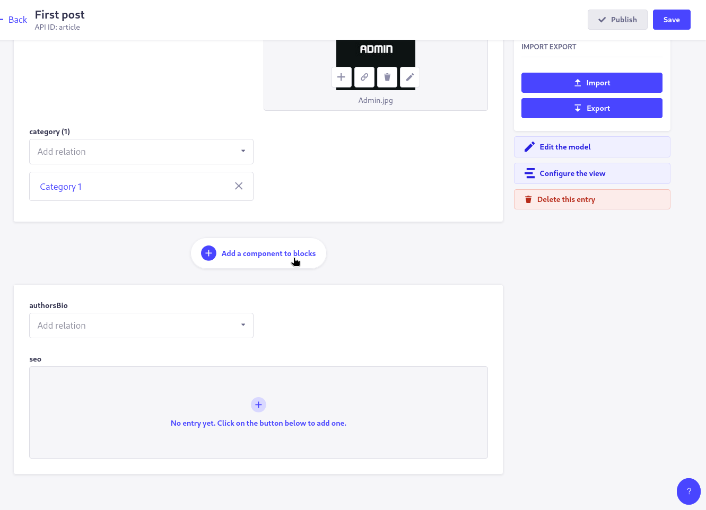

- Project: TheThreeAcross
- Version: V1.1
- Updated at: 23/07/2025
- Created at: 16/01/2025
- Created by: Atul Raj
- Approved by: Amit Gupta


Here's an improved version of your Content Management Documentation with better English, narration, and flow:

---

# TheThreeAcross CMS User Guide

## 1. Getting Started

### Accessing the CMS
1. Navigate to: [https://api.thethreeacross.com/admin/auth/login](https://api.thethreeacross.com/admin/auth/login)
2. Enter your credentials (to be provided separately)
3. After successful login, you'll be redirected to the Dashboard


The **Content Manager** tab will be your primary workspace for managing website content.

## 2. Content Manager Overview

### 2.1 Managing Articles

Articles represent the blog posts on your website.


#### Creating a New Article
1. Click "Create new entry"
2. Fill out the article form:


#### Article Fields Explained

**1. Title**  
Enter the headline of your article.

**2. Description**  
Provide a brief summary of the article content.

**3. Slug**  
This generates the URL for your article.  
- If not auto-generated, click "Regenerate"  
- Example: `your-article-title` becomes `yourwebsite.com/blog/your-article-title`


**4. Cover Image**  
Add a featured image for your article:
1. Click the image selector
2. Choose from existing assets or upload new ones
3. Drag and drop images from your computer


**5. Category**  
Select an existing category or create a new one (see [Category Management](#22-category-management)).

**6. Content**  
This is where you'll build your article body:



1. Click "Add a component to blocks"
2. Select "Rich text" for the main content area

The editor supports Markdown formatting with these key elements:
- Headings (H1-H6)
- Text formatting (bold, italic, underline)
- Lists (ordered and unordered)
- Code blocks, images, links, and quotes

**Markdown Cheat Sheet:**
```markdown
# Main Heading (H1)
## Subheading (H2)

**Bold text**
*Italic text*
<u>Underlined text</u>

1. Ordered list
2. Second item

- Unordered list
- Another item


[Link Text](url)
```

**7. Author Bio**  
Select or create an author profile (see [Author Management](#23-author-management)).

**8. Article Status**  
Important: Articles default to "Draft" status.  
- Change to "Publish" to make the article live on the website
- Use the dropdown menu to update status


### 2.2 Category Management

Categories help organize your articles by topic.


#### Creating a New Category
1. Navigate to the Category section
2. Click "Create new entry"
3. Fill out:
   - Name: The display name of your category
   - Slug: URL-friendly version (auto-generates or click "Regenerate")


### 2.3 Author Management

Author profiles establish credibility and personality for your content.


#### Creating a New Author
1. Go to the Author section
2. Click "Create new entry"
3. Provide:
   - Name: The author's full name
   - Profile Image: Upload a headshot
   - Email: Optional contact information


## Best Practices

1. Always preview your content before publishing
2. Use descriptive slugs for better SEO
3. Maintain consistent formatting throughout articles
4. Double-check article status before saving changes
5. Organize content with appropriate categories

For more Markdown syntax help, visit: [Markdown Guide](https://www.markdownguide.org/basic-syntax/)

