## Pages

### 1. Home /

#### Hero Section


- Static
- Data source:

```ts
const heroes: HeroProps[] = [
  {
    imgSrc: "/images/main/slide1.jpg",
    heading: "Bringing Partnership back to recruitment",
    highlightedWord: "Partnership",
    highlightColor: "text-red-600",
  },
  {
    imgSrc: "/images/main/slide2.jpg",
    heading: "Bringing Passion back to talent acquisition",
    highlightedWord: "Passion",
    highlightColor: "text-yellow-300",
  },
  {
    imgSrc: "/images/main/slide3.jpg",
    heading: "Bringing Inclusivity back to hiring",
    highlightedWord: "Inclusivity",
    highlightColor: "text-blue-400",
  },
];
```


#### Services Section


- Dynamic
- Data source
    - CMS

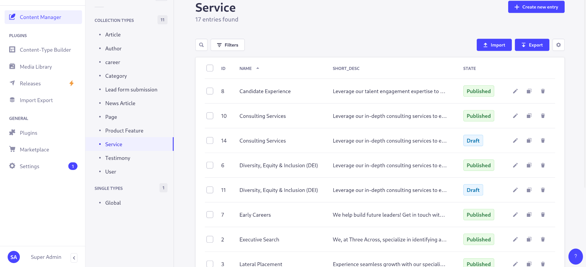


#### Blogs Section

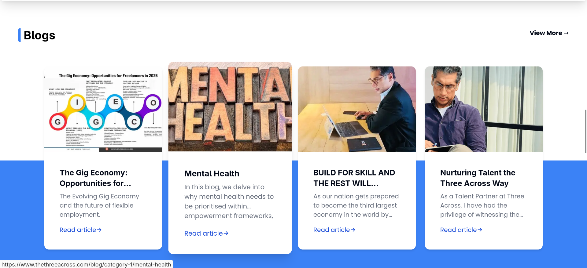

- Dynamic
- Data source
    - CMS

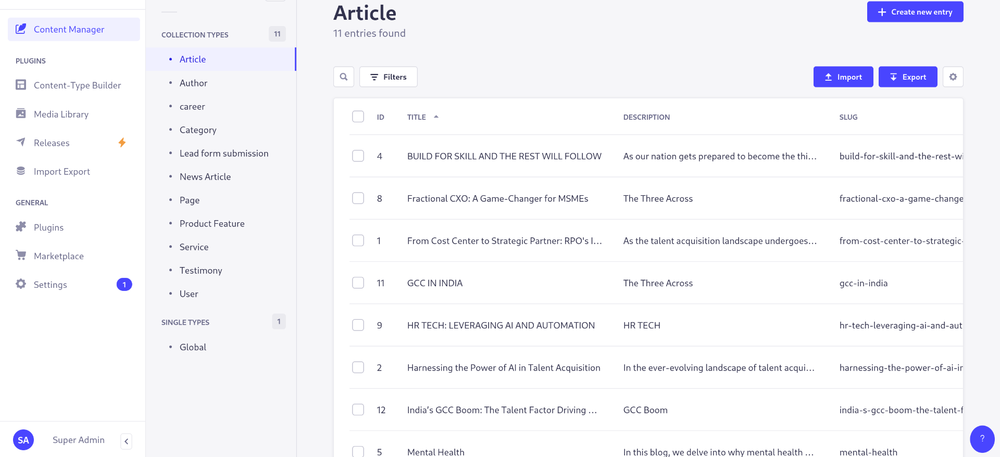


#### Testimony Section

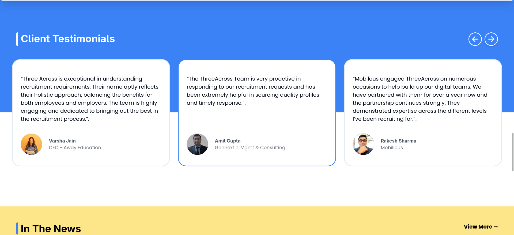


- Dynamic
- Data source
    - CMS


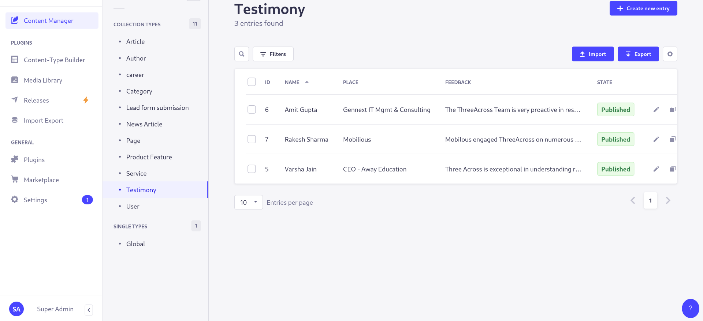


#### News Section

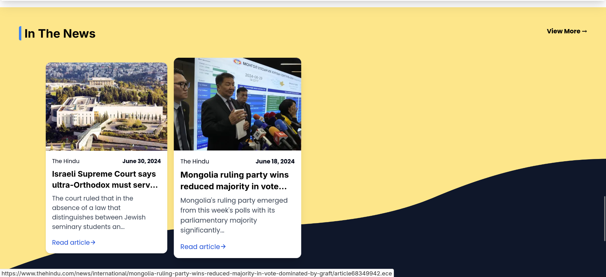


- Dynamic
- Data source
    - CMS

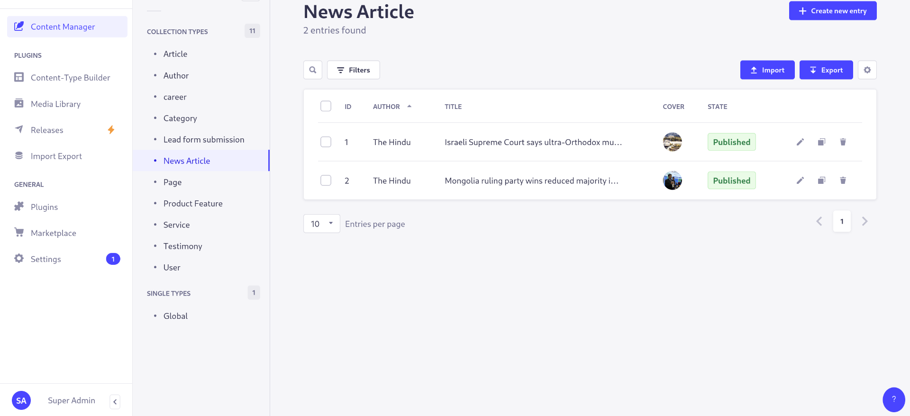


### 2. About Us /about


#### About Us Section


- Static


#### Our Values Section


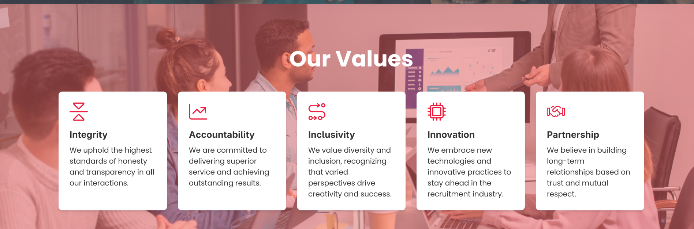

- Static

#### Our Leadership Section


- Dynamic
    - CMS

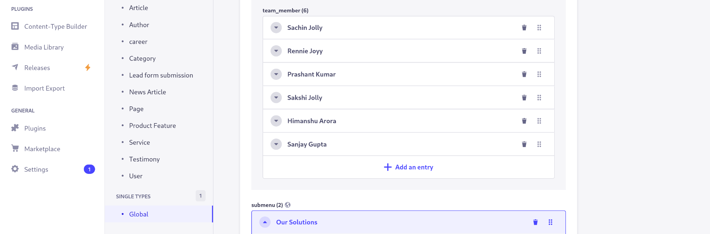


#### Why Choose Section


- Static


#### FAQ Section

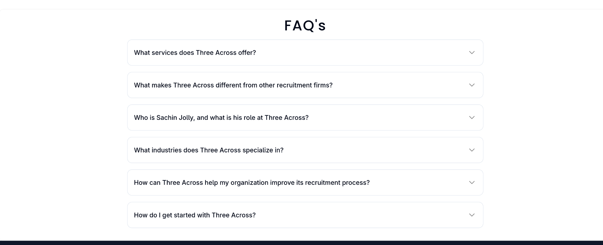

- Dynamic
    - CMS

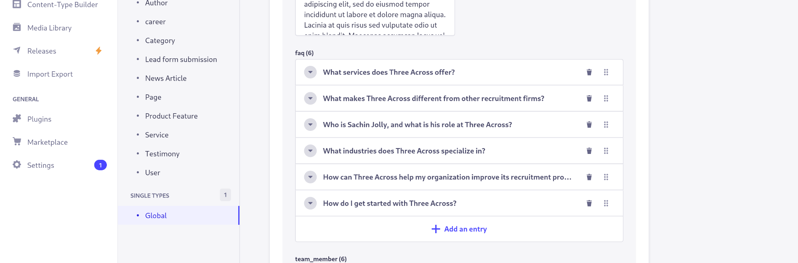


### 3. Services /services

#### Services Grid Section


- Dynamic
    - CMS


### 4. Careers /careers


#### Career Section

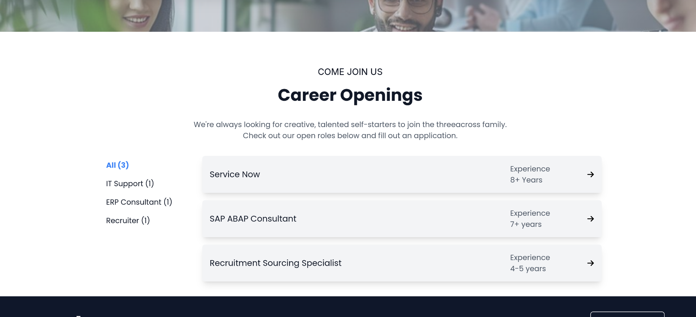


### 5. Blogs /blog

#### Blogs Carousel Section


- Dynamic
    - CMS


#### Blogs Grid Section


- Dynamic
    - CMS


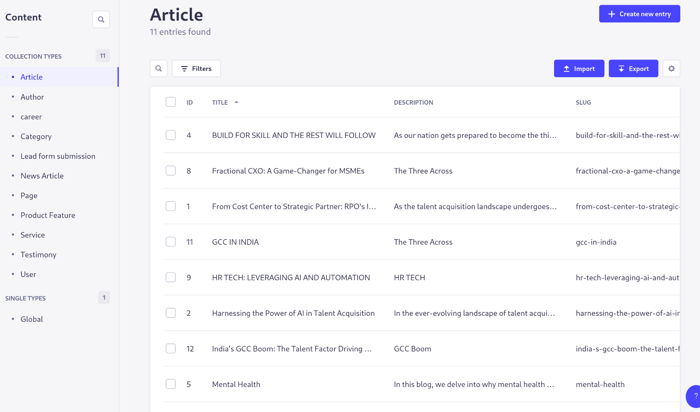 

### 6. Contact Us /contact


#### Contact Form Section

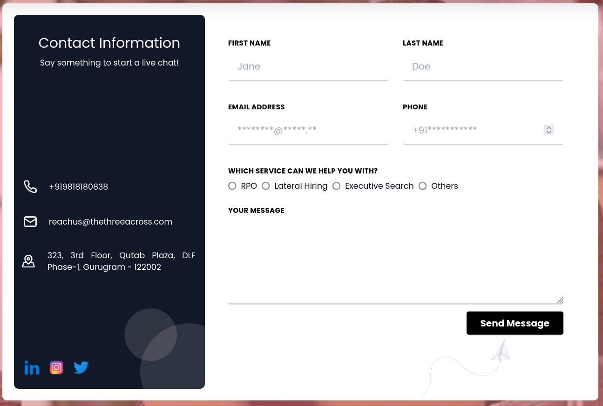

- Dynamic
    - CMS

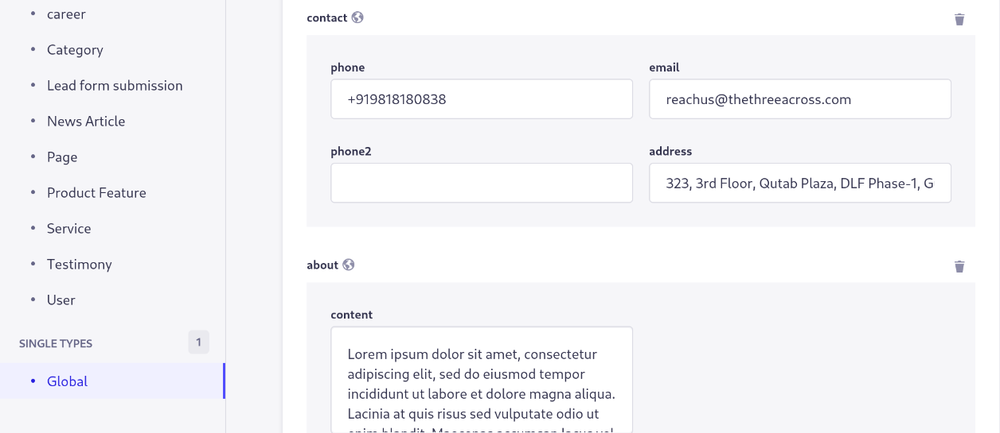